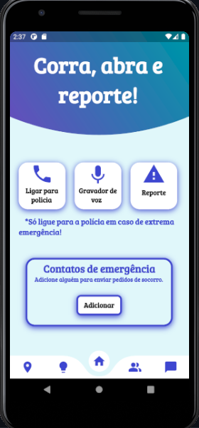

<h1 align="center">
    
</h1>

<h4 align="center">
  🚀 Trabalho de Conclusão de Curso 
</h4>

<p align="center">|&nbsp;&nbsp;&nbsp;
  <a href="#-tecnologias">Tecnologias</a>&nbsp;&nbsp;&nbsp;|&nbsp;&nbsp;&nbsp;
  <a href="#-projeto">Projeto</a>&nbsp;&nbsp;&nbsp;|&nbsp;&nbsp;&nbsp;
  <a href="#-como-contribuir">Como usar</a>&nbsp;&nbsp;&nbsp;|&nbsp;&nbsp;&nbsp;
</p>

<br>

<p align="center">
  
</p>

## 🚀 Tecnologias

Esse projeto foi desenvolvido com as seguintes tecnologias:

- [Flutter](https://flutter.dev/?gclid=CjwKCAjwr56IBhAvEiwA1fuqGuuL6xMtSn6bn5ZFHu5BoCB92NWpMj0gjLCmPpmbANQuCkqJ-SRxBxoCPfEQAvD_BwE&gclsrc=aw.ds)
- [Dart](https://dart.dev/get-dart)
- [Firebase](https://firebase.google.com/?hl=pt)
- [VS Code](https://code.visualstudio.com/download)

## 💻 Projeto

O Help for you é um aplicativo mobile que visa influenciar e auxiliar mulheres, vítimas de todo tipo de violência, a dununciar casos de agressões sofridas por ela e por outras.

## 🤔 Como Usar 

   ```
   - Clone esse repositório:
   $ git clone https://github.com/rocketseat-education/nlw-06-flutter

   - Entre no diretório:
   $ cd nlw-06-flutter

   - Instale as dependências:
   $ flutter pub get

   - Inicie o app: 
   $ flutter run
   ```


---

Feito com ♥ by Eloise :wave: 
